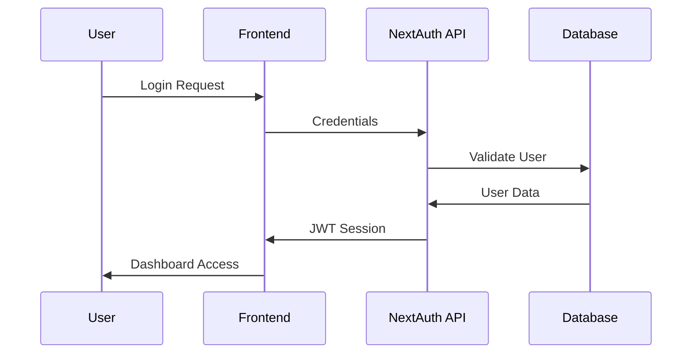
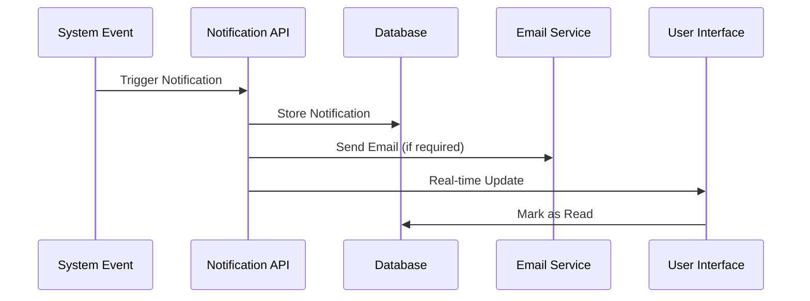
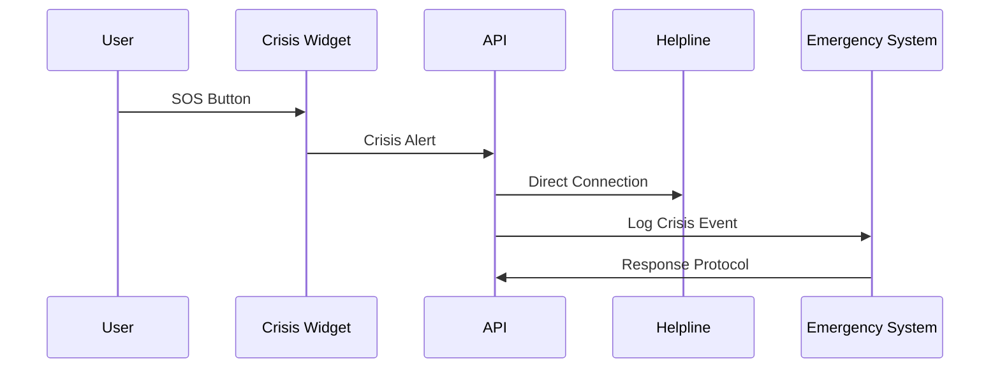
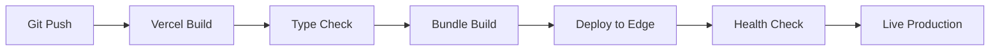

# EduSense - System Architecture Documentation

## Overview

EduSense is a modern, full-stack web application built with Next.js 14, designed to provide comprehensive student success management through intelligent monitoring, gamified engagement, and proactive crisis intervention. The architecture follows a serverless-first approach optimized for scalability and performance.

## Table of Contents

1. [High-Level Architecture](#high-level-architecture)
2. [Technology Stack](#technology-stack)
3. [Project Structure](#project-structure)
4. [Data Flow](#data-flow)
5. [Authentication & Authorization](#authentication--authorization)
6. [Database Design](#database-design)
7. [Component Architecture](#component-architecture)
8. [API Design](#api-design)
9. [State Management](#state-management)
10. [Security Architecture](#security-architecture)
11. [Performance Optimization](#performance-optimization)
12. [Deployment Architecture](#deployment-architecture)

## High-Level Architecture

```
┌─────────────────────────────────────────────────────────────┐
│                        Frontend Layer                       │
├─────────────────────────────────────────────────────────────┤
│  Next.js 14 App Router + React 18 + TypeScript + Tailwind   │
│                                                             │
│  ┌─────────────┐ ┌─────────────┐ ┌─────────────┐            │
│  │   Student   │ │   Mentor    │ │   Admin /   │            │
│  │  Dashboard  │ │  Dashboard  │ │ Counselor   │            │
│  └─────────────┘ └─────────────┘ └─────────────┘            │
└─────────────────────────────────────────────────────────────┘
                              │
                              ▼
┌─────────────────────────────────────────────────────────────┐
│                      API Layer                              │
├─────────────────────────────────────────────────────────────┤
│              Next.js API Routes (Serverless)                │
│                                                             │
│  ┌─────────────┐ ┌─────────────┐ ┌─────────────┐            │
│  │    Auth     │ │   Student   │ │   Crisis    │            │
│  │     API     │ │     API     │ │  Support    │            │
│  └─────────────┘ └─────────────┘ └─────────────┘            │
│                                                             │
│  ┌─────────────┐ ┌─────────────┐ ┌─────────────┐            │
│  │Notification │ │  Analytics  │ │   Email     │            │
│  │     API     │ │     API     │ │  Service    │            │
│  └─────────────┘ └─────────────┘ └─────────────┘            │
└─────────────────────────────────────────────────────────────┘
                              │
                              ▼
┌─────────────────────────────────────────────────────────────┐
│                    Data Layer                               │
├─────────────────────────────────────────────────────────────┤
│                    MongoDB Atlas                            │
│                                                             │
│  ┌─────────────┐ ┌─────────────┐ ┌─────────────┐            │
│  │    Users    │ │  Students   │ │Notifications│            │
│  │ Collection  │ │ Collection  │ │ Collection  │            │
│  └─────────────┘ └─────────────┘ └─────────────┘            │
│                                                             │
│  ┌─────────────┐ ┌─────────────┐ ┌─────────────┐            │
│  │ Attendance  │ │Achievements │ │   Crisis    │            │ 
│  │ Collection  │ │ Collection  │ │   Logs      │            │
│  └─────────────┘ └─────────────┘ └─────────────┘            │
└─────────────────────────────────────────────────────────────┘
                              │
                              ▼
┌─────────────────────────────────────────────────────────────┐
│                External Services                            │
├─────────────────────────────────────────────────────────────┤
│  ┌─────────────┐ ┌─────────────┐ ┌─────────────┐            │
│  │   Vercel    │ │   SMTP      │ │   Crisis    │            │
│  │  Hosting    │ │  Service    │ │  Helplines  │            │
│  └─────────────┘ └─────────────┘ └─────────────┘            │
└─────────────────────────────────────────────────────────────┘
```

## Technology Stack

### Frontend Technologies
```typescript
{
  "framework": "Next.js 14",
  "runtime": "React 18",
  "language": "TypeScript",
  "styling": "Tailwind CSS",
  "icons": "Lucide React",
  "state": "React Context + useState/useEffect",
  "forms": "React Hook Form",
  "charts": "Chart.js / Recharts",
  "notifications": "Custom React Context System"
}
```

### Backend Technologies
```typescript
{
  "api": "Next.js API Routes",
  "authentication": "NextAuth.js",
  "database": "MongoDB with Mongoose ODM",
  "email": "Nodemailer",
  "validation": "Zod",
  "middleware": "Next.js Middleware",
  "encryption": "bcrypt"
}
```

### Infrastructure
```typescript
{
  "hosting": "Vercel (Serverless)",
  "database": "MongoDB Atlas",
  "cdn": "Vercel Edge Network",
  "ssl": "Automatic HTTPS",
  "compression": "Gzip/Brotli",
  "monitoring": "Vercel Analytics"
}
```

## Project Structure

```
SIH2/
├── app/                          # Next.js 14 App Router
│   ├── api/                      # API Routes
│   │   ├── auth/                 # Authentication endpoints
│   │   ├── students/             # Student management
│   │   ├── notifications/        # Notification system
│   │   ├── crisis/               # Crisis support
│   │   └── analytics/            # Performance analytics
│   │
│   ├── (auth)/                   # Authentication pages
│   │   ├── signin/
│   │   └── signup/
│   │
│   ├── student/                  # Student role pages
│   │   ├── dashboard/
│   │   ├── attendance-manager/
│   │   ├── academic-support/
│   │   ├── financial-support/
│   │   ├── counseling/
│   │   └── test-portal/
│   │
│   ├── teacher/                  # Teacher role pages
│   │   ├── dashboard/
│   │   └── student-management/
│   │
│   ├── admin/                    # Admin role pages
│   │   ├── dashboard/
│   │   └── system-management/
│   │
│   ├── notifications/            # Notifications page
│   ├── globals.css              # Global styles
│   ├── layout.tsx               # Root layout
│   ├── page.tsx                 # Home page
│   └── providers.tsx            # App providers
│
├── components/                   # Reusable Components
│   ├── ui/                      # Base UI components
│   │   ├── Button.tsx
│   │   ├── Card.tsx
│   │   ├── Input.tsx
│   │   └── LoadingSpinner.tsx
│   │
│   ├── layout/                  # Layout components
│   │   ├── Navbar.tsx
│   │   ├── Sidebar.tsx
│   │   └── Footer.tsx
│   │
│   ├── dashboard/               # Dashboard components
│   │   ├── StatsCard.tsx
│   │   ├── ProgressChart.tsx
│   │   └── QuickActions.tsx
│   │
│   ├── notifications/           # Notification components
│   │   ├── NotificationProvider.tsx
│   │   ├── NotificationDropdown.tsx
│   │   └── NotificationBell.tsx
│   │
│   ├── crisis/                  # Crisis support components
│   │   ├── ImmediateHelpWidget.tsx
│   │   ├── CrisisChat.tsx
│   │   └── EmergencyContacts.tsx
│   │
│   └── gamification/            # Gamification components
│       ├── LevelProgress.tsx
│       ├── AchievementBadge.tsx
│       └── XPTracker.tsx
│
├── lib/                         # Utility libraries
│   ├── auth.ts                  # Authentication config
│   ├── mongodb.ts               # Database connection
│   ├── utils.ts                 # Helper functions
│   ├── validations.ts           # Input validations
│   └── constants.ts             # App constants
│
├── models/                      # Database models
│   ├── User.ts                  # User schema
│   ├── Student.ts               # Student schema
│   ├── Notification.ts          # Notification schema
│   ├── Attendance.ts            # Attendance schema
│   └── Achievement.ts           # Achievement schema
│
├── middleware.ts                # Next.js middleware
├── next.config.js              # Next.js configuration
├── tailwind.config.js          # Tailwind CSS config
├── tsconfig.json               # TypeScript config
└── package.json                # Dependencies
```

## Data Flow

### 1. User Authentication Flow


### 2. Notification System Flow


### 3. Crisis Support Flow


## Authentication & Authorization

### Authentication Strategy
```typescript
// NextAuth.js Configuration
export const authOptions: NextAuthOptions = {
  providers: [
    CredentialsProvider({
      name: "credentials",
      credentials: {
        email: { label: "Email", type: "email" },
        password: { label: "Password", type: "password" }
      },
      async authorize(credentials) {
        // Validate against database
        const user = await validateUser(credentials)
        return user ? { ...user, role: user.role } : null
      }
    })
  ],
  session: { strategy: "jwt" },
  callbacks: {
    async jwt({ token, user }) {
      if (user) {
        token.role = user.role
        token.studentId = user.studentId
      }
      return token
    },
    async session({ session, token }) {
      session.user.role = token.role
      session.user.studentId = token.studentId
      return session
    }
  }
}
```

### Role-Based Authorization
```typescript
// Role definitions
enum UserRole {
  STUDENT = "student",
  TEACHER = "teacher",
  ADMIN = "admin",
  COUNSELOR = "counselor"
}

// Authorization middleware
export function withAuth(roles: UserRole[]) {
  return function (handler: NextApiHandler) {
    return async (req: NextApiRequest, res: NextApiResponse) {
      const session = await getServerSession(req, res, authOptions)
      
      if (!session || !roles.includes(session.user.role)) {
        return res.status(403).json({ error: "Forbidden" })
      }
      
      return handler(req, res)
    }
  }
}
```

## Database Design

### User Collection Schema
```typescript
interface User {
  _id: ObjectId
  name: string
  email: string
  password: string // bcrypt hashed
  role: "student" | "teacher" | "admin" | "counselor"
  studentId?: string // for students only
  department?: string
  year?: number
  createdAt: Date
  updatedAt: Date
  lastLogin?: Date
  isActive: boolean
}
```

### Student Progress Schema
```typescript
interface StudentProgress {
  _id: ObjectId
  studentId: string
  attendance: {
    level: number
    xp: number
    percentage: number
    streak: number
    lastUpdate: Date
  }
  academic: {
    gpa: number
    assignments: {
      total: number
      completed: number
      pending: number
    }
    grades: Array<{
      subject: string
      score: number
      maxScore: number
      date: Date
    }>
  }
  achievements: Array<{
    id: string
    name: string
    description: string
    earnedAt: Date
    type: "attendance" | "academic" | "engagement"
  }>
  notifications: {
    unreadCount: number
    lastChecked: Date
  }
}
```

### Notification Schema
```typescript
interface Notification {
  _id: ObjectId
  userId: ObjectId
  title: string
  message: string
  type: "info" | "success" | "warning" | "achievement" | "reminder" | "alert"
  priority: "low" | "medium" | "high"
  read: boolean
  actionUrl?: string
  metadata?: Record<string, any>
  createdAt: Date
  readAt?: Date
  expiresAt?: Date
}
```

## Component Architecture

### Component Hierarchy
```
App Layout
├── Providers (Auth, Notifications, Theme)
├── Navbar
│   ├── Logo
│   ├── Navigation Menu
│   ├── Notification Bell
│   └── User Profile
├── Main Content
│   ├── Dashboard Components
│   │   ├── Stats Cards
│   │   ├── Progress Charts
│   │   └── Quick Actions
│   ├── Page-specific Components
│   └── Crisis Support Widget
└── Footer
```

### Key Component Patterns

#### 1. Provider Pattern (Notifications)
```typescript
// NotificationProvider.tsx
export const NotificationProvider: React.FC<{ children: React.ReactNode }> = ({ children }) => {
  const [notifications, setNotifications] = useState<Notification[]>([])
  
  const addNotification = useCallback((notification: Omit<Notification, 'id'>) => {
    const newNotification = { ...notification, id: generateId() }
    setNotifications(prev => [newNotification, ...prev])
  }, [])
  
  return (
    <NotificationContext.Provider value={{ notifications, addNotification }}>
      {children}
    </NotificationContext.Provider>
  )
}
```

#### 2. Compound Component Pattern (Dashboard)
```typescript
// Dashboard compound components
export const Dashboard = ({ children }: { children: React.ReactNode }) => {
  return <div className="dashboard-container">{children}</div>
}

Dashboard.Header = DashboardHeader
Dashboard.Stats = StatsSection
Dashboard.Charts = ChartsSection
Dashboard.Actions = QuickActions
```

#### 3. Render Props Pattern (Charts)
```typescript
// Flexible chart component
export const ProgressChart = ({ 
  data, 
  render 
}: { 
  data: ChartData
  render: (data: ChartData) => React.ReactNode 
}) => {
  return (
    <div className="chart-container">
      {render(data)}
    </div>
  )
}
```

## API Design

### RESTful API Structure
```typescript
// API endpoint patterns
const API_ROUTES = {
  // Authentication
  auth: {
    signin: "POST /api/auth/signin",
    signout: "POST /api/auth/signout",
    register: "POST /api/auth/register",
    session: "GET /api/auth/session"
  },
  
  // Student management
  students: {
    list: "GET /api/students",
    get: "GET /api/students/[id]",
    update: "PUT /api/students/[id]",
    attendance: "POST /api/students/[id]/attendance"
  },
  
  // Notifications
  notifications: {
    list: "GET /api/notifications",
    create: "POST /api/notifications",
    markRead: "PUT /api/notifications/[id]",
    delete: "DELETE /api/notifications/[id]"
  },
  
  // Crisis support
  crisis: {
    report: "POST /api/crisis/report",
    resources: "GET /api/crisis/resources",
    chat: "POST /api/crisis/chat"
  }
}
```

### API Response Format
```typescript
// Standardized API response
interface ApiResponse<T = any> {
  success: boolean
  data?: T
  error?: {
    code: string
    message: string
    details?: any
  }
  meta?: {
    pagination?: {
      page: number
      limit: number
      total: number
    }
    timestamp: string
  }
}
```

## State Management

### State Architecture
```typescript
// Global state through React Context
interface AppState {
  user: User | null
  notifications: Notification[]
  theme: "light" | "dark"
  crisis: {
    isActive: boolean
    sessionId?: string
  }
}

// Local component state
const [attendance, setAttendance] = useState<AttendanceData>()
const [loading, setLoading] = useState(false)
const [error, setError] = useState<string | null>(null)
```

### State Management Patterns
1. **Global State**: React Context for user session, notifications
2. **Local State**: useState for component-specific data
3. **Server State**: SWR/React Query patterns for API data
4. **URL State**: Next.js router for navigation state

## Security Architecture

### Security Layers

#### 1. Authentication Security
```typescript
// Password hashing
const hashPassword = async (password: string): Promise<string> => {
  return bcrypt.hash(password, 12)
}

// Session validation
const validateSession = async (req: NextApiRequest) => {
  const session = await getServerSession(req, res, authOptions)
  if (!session) throw new Error("Unauthorized")
  return session
}
```

#### 2. Input Validation
```typescript
// Zod schema validation
const StudentSchema = z.object({
  name: z.string().min(2).max(100),
  email: z.string().email(),
  studentId: z.string().regex(/^STU\d{3}$/),
  year: z.number().min(1).max(4)
})
```

#### 3. API Security
```typescript
// Rate limiting middleware
export const rateLimiter = rateLimit({
  windowMs: 15 * 60 * 1000, // 15 minutes
  max: 100, // limit each IP to 100 requests per windowMs
  message: "Too many requests from this IP"
})
```

#### 4. Data Protection
- **Encryption at rest**: MongoDB Atlas encryption
- **Encryption in transit**: HTTPS/TLS
- **Environment variables**: Secure configuration
- **Input sanitization**: XSS protection
- **CSRF protection**: Built-in Next.js protection

## Performance Optimization

### Frontend Optimizations
```typescript
// Code splitting
const LazyComponent = dynamic(() => import('./HeavyComponent'), {
  loading: () => <LoadingSpinner />,
  ssr: false
})

// Image optimization
import Image from 'next/image'
<Image 
  src="/dashboard-chart.png" 
  width={800} 
  height={600} 
  alt="Dashboard"
  priority={false}
/>

// Bundle analysis
// npm run build will show bundle size analysis
```

### Backend Optimizations
```typescript
// Database indexing
const userSchema = new Schema({
  email: { type: String, index: true, unique: true },
  role: { type: String, index: true },
  studentId: { type: String, index: true, sparse: true }
})

// API response caching
export const config = {
  api: {
    responseLimit: '8mb',
  },
}
```

### Performance Monitoring
- **Core Web Vitals**: Largest Contentful Paint, First Input Delay, Cumulative Layout Shift
- **Bundle Analysis**: webpack-bundle-analyzer integration
- **Database Performance**: MongoDB profiling and indexing
- **API Response Times**: Monitoring with Vercel Analytics

## Deployment Architecture

### Vercel Deployment
```typescript
// vercel.json configuration
{
  "builds": [
    {
      "src": "package.json",
      "use": "@vercel/next"
    }
  ],
  "env": {
    "MONGODB_URI": "@mongodb-uri",
    "NEXTAUTH_SECRET": "@nextauth-secret",
    "EMAIL_HOST": "@email-host"
  },
  "functions": {
    "app/api/**/*.ts": {
      "maxDuration": 30
    }
  }
}
```

### Environment Configuration
```bash
# Production environment variables
MONGODB_URI=mongodb+srv://...
NEXTAUTH_SECRET=secure-random-string
NEXTAUTH_URL=https://edusense.vercel.app
EMAIL_HOST=smtp.gmail.com
EMAIL_PORT=587
EMAIL_USER=notifications@edusense.edu
EMAIL_PASS=app-specific-password
CRISIS_EMAIL=crisis@edusense.edu
```

### Deployment Flow


## Scalability Considerations

### Horizontal Scaling
- **Serverless Functions**: Auto-scaling API routes
- **CDN Distribution**: Global edge network
- **Database Sharding**: MongoDB Atlas cluster scaling
- **Load Balancing**: Automatic Vercel load balancing

### Vertical Scaling
- **Database Optimization**: Indexing and query optimization
- **Bundle Optimization**: Code splitting and tree shaking
- **Image Optimization**: WebP format and lazy loading
- **Caching Strategy**: Static generation and API caching

### Future Enhancements
1. **Microservices**: Split large features into separate services
2. **Event-Driven Architecture**: Real-time notifications with WebSockets
3. **Machine Learning**: AI-powered risk prediction algorithms
4. **Mobile Applications**: React Native or Flutter apps
5. **Advanced Analytics**: Data warehousing and business intelligence

---

This architecture documentation provides a comprehensive overview of the EduSense system design, enabling developers to understand, maintain, and extend the platform effectively.

*Last updated: October 2025*